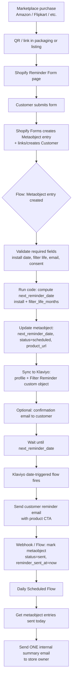
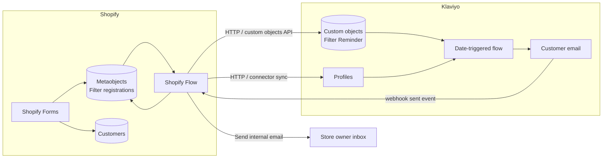

# Filter Replacement Reminder System — Technical Research & Solution Architecture

**Document type:** Research & solution design (pre-implementation)  
**Research date:** July 10, 2026  
**Scope:** Marketplace (Amazon/Flipkart/etc.) one-time filter buyers → Shopify Forms registration → automated replacement reminders → daily admin summary  
**Sources:** Shopify Help Center, Shopify Changelog, Shopify.dev Admin API docs, Klaviyo Help Center / Developer docs (2025–2026)

---

## Executive recommendation

**Best long-term production architecture:**

| Layer | Technology | Role |
| --- | --- | --- |
| Capture | **Shopify Forms** (already in use) | Collect registration data |
| System of record | **Shopify Metaobjects** (form submissions + enrichment fields) | One entry per filter registration; supports multiple filters per customer |
| Orchestration | **Shopify Flow** | Ingest form → calculate next reminder date → sync outbound → daily admin digest |
| Customer email | **Klaviyo** (date-property / custom-object flows) | Reliable date-based reminder delivery at scale |
| Admin summary | **Shopify Flow** (Scheduled time + Get metaobject entries + Send internal email) | One consolidated daily report |

**Why this stack:** Shopify’s native Forms → Metaobjects → Flow path is officially supported and excellent for capture, storage, calculation, and admin reporting. Shopify Email / Flow marketing email alone is **not** sufficient for production date-based reminders at scale (marketing-consent gate, weak multi-filter modeling, Get-data 100-item batching). Klaviyo’s date-triggered flows are purpose-built for “reorder / replacement on a stored date” and scale to thousands of profiles. A full custom app is only justified if you outgrow this hybrid or need non-email channels / complex multi-cycle logic in-house.

**Shopify Functions:** Not applicable. Functions customize checkout, cart, discounts, delivery, and payment logic — not email scheduling or form automation.

---

## 1. Is this workflow possible using Shopify’s native ecosystem?

### Short answer

**Partially yes.** Capture, storage, date calculation, and admin digests can be built natively. **Reliable, scalable customer reminder email on a dynamic future date is the weak point** of a pure-native stack.

### Capability map

| Requirement | Native capability | Verdict |
| --- | --- | --- |
| Form capture | Shopify Forms | ✅ Already in place |
| Persist each submission | Forms → **metaobject entry** (official) | ✅ Preferred over customer metafields alone |
| Link to customer | Forms auto-links / creates customer by email | ✅ |
| Calculate next reminder date | Flow **Run code** / Liquid on Metaobject entry created | ✅ |
| Store reminder schedule | Metaobject fields + optional customer metafields | ✅ |
| Fire on reminder date | (A) Customer segment + **Customer joined segment**, or (B) **Scheduled time** + **Get metaobject entries** | ⚠️ Possible with limits |
| Send customer reminder email | Shopify Email / Flow “Send marketing email” | ⚠️ Requires marketing consent; not true transactional |
| Product deep link CTA | Liquid / email template product URL | ✅ |
| Log reminder sent | Update metaobject fields via Flow / Admin API | ✅ |
| Daily admin summary | Scheduled Flow + Get metaobject entries + Send internal email | ✅ (official daily-summary pattern; 100/batch) |
| Shopify Customer Accounts | Optional; not required for form-based capture | ⚪ Optional |
| Customer metafields | Useful for segment triggers; poor for many filters/customer | ⚠️ Limited |
| Metaobjects | Best native store for registrations | ✅ |
| Admin API | Available via Flow “Send Admin API request” | ✅ |
| Shopify Functions | N/A for this use case | ❌ |

### Official native building blocks (current)

1. **Shopify Forms → Metaobjects**  
   Form submissions create metaobject entries. Custom fields can map to the metaobject (full submission history) and/or customer metafields. Mapping only to customer metafields **overwrites** prior submissions — unsuitable when one customer registers multiple filters.

2. **Flow: Metaobject entry created**  
   Official Forms processing path. Templates exist for internal email, marketing email, and Google Sheets.

3. **Flow: Get metaobject entries / Get metaobject entry** (Jan 2025+)  
   Enables scheduled workflows that query metaobjects by filterable field values (e.g. `next_reminder_date`, `status`).

4. **Customer segments + Customer joined segment**  
   Shopify’s documented pattern for restock / repurchase reminders and birthday-style date automations: store a date metafield → segment where date matches today (or offset) → Flow / marketing automation on join.

5. **Flow: Scheduled time**  
   Recurring daily/hourly jobs; used officially for daily summary emails. Combined with Get data actions (max **100** results per run).

### Native limitations (must design around)

| Limitation | Impact |
| --- | --- |
| Flow **Get \* data** max **100** items per run | If >100 reminders due in one day, need hourly batching + “processed” flags/tags |
| Shopify Email / Flow marketing email requires **email marketing consent** | Marketplace buyers who only fill the form may not receive reminders unless the form collects consent |
| No native Flow “send transactional email to customer” | Confirmed by Shopify Flow staff; 3P apps or external ESP required for non-marketing sends |
| Customer metafield = one value per key | Multiple active filters per customer need metaobjects (or list/metaobject references), not a single date metafield |
| Segment join fires on **join**, not for people already in the segment | Backfill / timing edge cases need care |
| Metaobject field queries require **filterable** fields (`admin_filterable`) | Must enable filtering on `next_reminder_date`, `status`, etc. |
| Pure Shopify Email lacks Klaviyo-style “date property trigger” | Segments + Flow approximate it; ESP date flows are more reliable |

### Conclusion on native-only

A **native-only MVP** is feasible for low–moderate volume (well under ~100 due reminders/day) **if** marketing consent is collected on the form. For thousands of customers, multiple filters per person, and production-grade deliverability, add **Klaviyo** (or equivalent ESP) for customer email.

---

## 2. Are third-party services required?

### Recommendation

| Service | Required? | Why |
| --- | --- | --- |
| **Klaviyo** (or Omnisend) | **Strongly recommended** for production | Native date-property / custom-object flows; deliverability; scale; product personalization |
| Custom Shopify app | Optional | Only if you need custom UI, complex multi-cycle rules, SMS, or >Flow batching without ESP |
| External database | Optional | Prefer Shopify metaobjects first; app DB only with custom app |
| Webhooks | Optional | Flow HTTP / Klaviyo sync; useful for custom app |
| Cron / scheduled jobs | Covered by Flow Scheduled time or Klaviyo’s daily date evaluation | No separate cron needed in hybrid design |
| Zapier/Make | Not recommended as core | Extra cost/latency; Flow + Klaviyo already cover the path |
| Shopify Functions | Not used | Wrong product surface |

### Klaviyo

| | |
| --- | --- |
| **Why needed** | Date-triggered flows (including “reorder product”); daily evaluation of date properties; custom objects for many filters per profile; better deliverability tooling |
| **Advantages** | Purpose-built date flows (monthly / yearly / once); custom objects for multi-filter; Shopify sync; templates with product CTAs; scales to thousands of profiles |
| **Limitations** | Recurring cost by active profiles; custom objects need paid email plan; must keep Shopify ↔ Klaviyo data in sync; consent/compliance still required |
| **Cost** | Free ≤250 profiles; paid Email plan scales with active profiles (roughly tens to hundreds USD/month at mid-market sizes — verify current calculator). Custom objects included on paid email plans (property/record limits by plan) |
| **Scalability** | Excellent for this use case |

### Omnisend (alternative ESP)

Similar automation positioning; choose if already in stack. Klaviyo is preferred here for documented date-property + custom-object flow patterns matching multi-filter warranties/replacements.

### Custom Shopify app

| | |
| --- | --- |
| **Why** | Full control: calculate dates, send via SES/SendGrid, admin digest, multi-cycle reschedule, SMS |
| **Advantages** | No 100-item Flow limit; transactional email; complex business rules |
| **Limitations** | Build + host + maintain; app review if public; higher upfront cost |
| **Cost** | Dev effort + hosting + email provider |
| **When** | >hundreds of due reminders/day, multi-channel, or ESP not desired |

### Do not add unnecessarily

Avoid a separate external DB, Zapier, and a custom app **if** Forms + Metaobjects + Flow + Klaviyo meet requirements — they do for most water-filter merchants.

---

## 3. Reminder scheduling — calculation & storage

### Calculation rule

```
next_reminder_date = installation_date + filter_life_months
```

Examples:

| Installation | Filter life | Next reminder |
| --- | --- | --- |
| 2026-01-01 | 1 Month | 2026-02-01 |
| 2025-11-01 | 3 Months | 2026-02-01 |
| 2025-07-01 | 12 Months | 2026-07-01 |

**Implementation notes:**

- Prefer **calendar months**, not fixed 30-day multiples (matches merchant language: “1 Month”, “3 Months”).
- In Flow, use **Run code** (JavaScript) to parse filter life → months integer and add to installation date (handle month-end: Jan 31 + 1 month → Feb 28/29).
- Store dates as ISO `YYYY-MM-DD` (Shopify date fields / Klaviyo accepted formats).
- Time zone: use **store timezone** consistently for “due today” queries and segment matching.

### Where to store the schedule

| Store | Use for | Pros | Cons |
| --- | --- | --- | --- |
| **Metaobject entry (recommended SoR)** | Each registration | Multiple filters/customer; queryable; Forms-native; audit trail | Not directly usable in customer segments |
| **Customer metafield `next_reminder_date`** | Segment join trigger (optional) | Official restock/birthday pattern | One active date per customer unless lists/refs |
| **Klaviyo profile date property** | Simple single-filter date flow | Easy date trigger | Overwrites; weak multi-filter |
| **Klaviyo custom object** | Multi-filter date flows | Many records/profile; date-trigger on object date | Paid plan; sync complexity |
| **Shopify Flow Wait** | Delay from form submit | Simple | Breaks for long waits / edits; not for arbitrary install dates in the past |
| **Custom DB** | Custom app only | Unlimited | Extra infra |

### Recommended storage model (metaobject)

Enrich each Forms metaobject entry (or a dedicated `filter_reminder` metaobject) with:

| Field | Type | Notes |
| --- | --- | --- |
| `customer_name` | single_line_text | From form |
| `email` | single_line_text | Filterable |
| `phone` | single_line_text | |
| `address` | multi_line_text / JSON | As needed |
| `filter_type` | single_line_text / metaobject_reference | Map to product |
| `filter_life` | single_line_text | e.g. `1 Month` |
| `filter_life_months` | number_integer | Normalized |
| `purchase_date` | date | |
| `installation_date` | date | **Anchor** |
| `next_reminder_date` | date | **Computed; filterable** |
| `product_url` | url | CTA target |
| `status` | single_line_text | `scheduled` \| `sent` \| `cancelled` \| `rescheduled` — **filterable** |
| `reminder_sent_at` | date_time | When customer email sent |
| `customer_gid` | single_line_text | Optional link |

Enable **admin filterable** on `next_reminder_date`, `status`, `email`, and ideally `reminder_sent_at`.

### Scheduling mechanism options

**Option A — Klaviyo date trigger (recommended for customer email)**  
Sync `next_reminder_date` (profile property or custom object date). Flow: Date property → start **on** date → frequency **Should not repeat** → send email → (optional) webhook back to Shopify to mark `status=sent`.

**Option B — Native segment join**  
Copy `next_reminder_date` to customer metafield → segment `customer.metafields…next_reminder_date = today` (or BETWEEN today AND today) → Customer joined segment → send email. Best for **one active reminder per customer**.

**Option C — Native scheduled metaobject sweep**  
Daily/hourly Scheduled Flow → Get metaobject entries  
`fields.status:scheduled AND fields.next_reminder_date:'{{ scheduledAt | date: "%Y-%m-%d" }}'`  
→ For each → send email → update status. Best native path for **multi-filter** without Klaviyo; respect 100/batch.

---

## 4. Email automation

### Requirements vs platforms

| Need | Shopify Email + Flow | Klaviyo |
| --- | --- | --- |
| Dynamic reminder dates | Via segments or scheduled metaobject query | Native date-property / object date trigger |
| Multiple filter lifespans | Yes, if date pre-computed | Yes |
| Thousands of customers | Awkward (100 batch, consent) | Designed for this |
| Reliable delivery | Basic | Strong ESP tooling |
| Easy maintenance | Medium (many Flows/segments) | High (one date flow + splits) |
| Product CTA | Yes | Yes (catalog sync) |
| Marketing consent | **Required** for marketing sends | Required for marketing; transactional options exist on ESP |

### Recommendation

**Use Klaviyo for customer reminder emails.** Shopify Email alone is insufficient as the primary engine for this product requirement.

Suggested Klaviyo design:

1. **Trigger:** Date property on custom object `Filter Reminder` → field `next_reminder_date` (preferred for multi-filter), **or** profile property if one filter max.
2. **Start:** On the date.
3. **Repeat:** Should not repeat (one-shot per computed date).
4. **Content:** Name, filter type, life, install date, CTA to `product_url`.
5. **After send:** Update Shopify metaobject `status=sent`, `reminder_sent_at=now` (Flow webhook / Klaviyo webhook / custom sync).
6. **Optional renewal:** If customer should get another cycle without re-form, set new `next_reminder_date = previous + filter_life_months` and `status=scheduled`.

### Consent & compliance

- Reminder emails that promote purchasing a replacement are typically **marketing**, not pure transactional.
- Collect **email marketing consent** on the Shopify Form (checkbox + clear language).
- Configure SPF / DKIM / DMARC for the sending domain (Shopify Email and/or Klaviyo).
- Honor unsubscribes; suppress cancelled reminders in metaobject `status`.

---

## 5. Daily admin summary

### Requirement

One email per 24 hours listing all customer reminders sent that day — not one admin email per customer.

### Best approach (native Flow — recommended)

Matches official Shopify Flow templates (“Send daily email summary…”):

```
Scheduled time (daily, e.g. 21:00 store TZ)
  → Get metaobject entries
       query: fields.status:sent AND fields.reminder_sent_at in today's window
       (or tag/metafield equivalent)
  → Count
  → Send internal email (owner address)
       subject: Daily Filter Reminder Report — {{ date }}
       body: total + HTML/Markdown table of rows
```

**Table columns:** Customer, Email, Phone, Filter, Filter Life, Installation Date, Reminder Date, Status.

### Implementation details

1. When a customer reminder is sent, **immediately** set `reminder_sent_at` and `status=sent` on the metaobject (from Klaviyo webhook or native send path).
2. End-of-day Flow queries those entries.
3. If volume may exceed 100 sent/day: run Get metaobject entries every hour into a **daily report metaobject** / Google Sheet row append, then one evening email; or accept multiple digest pages; or use custom app.

### Alternatives

| Approach | Verdict |
| --- | --- |
| Flow Send internal email on each send | ❌ Violates “one consolidated email” |
| Google Sheets append + nightly email | ✅ Good overflow / audit trail (Forms Flow template exists) |
| Klaviyo flow analytics only | ⚠️ Incomplete for custom columns (phone, install date) |
| Custom app digest | ✅ Best at very high volume |

---

## 6. Data storage strategy

### Comparison

| Approach | Advantages | Disadvantages | Scale |
| --- | --- | --- | --- |
| **Customer metafields** | Segment filters; simple | One value/key; multi-filter collision; Forms overwrite risk | Poor for many registrations |
| **Metaobjects** | One entry per registration; Forms-native; Flow queryable; admin UI | Not in customer segments directly; filterable caps | **Best native SoR** |
| **Shopify Customers** | Identity, consent, addresses | Not a reminder ledger | Use as identity layer |
| **Orders** | N/A for marketplace purchases | No Shopify order for Amazon/Flipkart | ❌ |
| **Custom app DB** | Unlimited queries/reporting | Build/host | Enterprise |
| **External DB only** | Flexible | Sync drift; dual truth | Avoid as sole SoR |

### Recommendation

**System of record: Metaobjects** (Forms submission + computed scheduling fields).  
**Identity: Shopify Customer** (email key).  
**Delivery state mirror: Klaviyo** profile/custom object for sending.  
**Optional:** Customer metafield only if using native segment-join path for a single active reminder.

For thousands of reminder records, metaobjects + filterable fields + Flow/API queries are appropriate. Move to an app database when you need complex reporting, >100 due/day without batching gymnastics, or multi-channel orchestration.

---

## 7. End-to-end flow architecture

### Customer journey & automation diagram



### Data flow



### Flow inventory (to build)

| # | Trigger | Purpose |
| --- | --- | --- |
| 1 | Metaobject entry created (Forms definition) | Validate, calculate date, set status, set product URL, sync Klaviyo |
| 2 | (Optional) Customer joined segment | Native-only email path |
| 3 | Klaviyo date flow | Customer reminder email |
| 4 | Webhook / custom event “reminder_sent” | Update metaobject sent fields |
| 5 | Scheduled daily | Admin consolidated report |
| 6 | (Optional) Scheduled hourly | Batch process due metaobjects if native send path |

---

## 8. Technical prerequisites checklist

### Shopify plan & apps

- [ ] Any paid Shopify plan (Basic+) — **Flow is included** on Basic/Shopify/Advanced/Plus (since 2023)
- [ ] **Shopify Flow** installed
- [ ] **Shopify Forms** installed; reminder form live
- [ ] Form fields map primarily to **metaobject** storage (not only customer metafields)
- [ ] Marketing consent checkbox on form (if using marketing email / Klaviyo marketing)

### Custom data

- [ ] Metaobject definition for form (auto) **or** dedicated `filter_reminder` definition
- [ ] Fields: filter type, life, install date, purchase date, contact fields, computed dates, status, product URL
- [ ] Enable **filterable** on `next_reminder_date`, `status`, `email`, `reminder_sent_at`
- [ ] Optional customer metafields: `next_reminder_date` (date), `filter_type` (if segment path)
- [ ] Product URL mapping table (filter type → Shopify product/variant URL) — metaobject or Flow Run code map

### Email

- [ ] **Klaviyo** account + Shopify integration
- [ ] Custom object schema `Filter Reminder` (if multi-filter) **or** profile date property
- [ ] Date-triggered flow configured (on date, should not repeat)
- [ ] Email template with personalization + CTA
- [ ] Domain authentication: SPF, DKIM, DMARC
- [ ] Sender identity aligned with brand domain
- [ ] Unsubscribe / preference center verified

### Automation & API

- [ ] Flow workflow(s) for form ingest + date math (Run code)
- [ ] Sync path Shopify → Klaviyo (Flow HTTP to Klaviyo API, or middleware)
- [ ] Webhook Klaviyo → Shopify (or Flow) to mark sent
- [ ] Daily Scheduled Flow + Get metaobject entries + Send internal email
- [ ] Admin API access via Flow “Send Admin API request” for metaobject updates (`metaobjectUpdate` / `metaobjectUpsert`)
- [ ] If custom app: scopes `read_metaobjects`, `write_metaobjects`, `read_customers`, `write_customers`, etc.

### Operations

- [ ] Store timezone confirmed for schedules
- [ ] Owner email(s) for daily digest
- [ ] QA plan: test install dates across month ends; each filter life; multi-filter same email
- [ ] Monitoring: Flow run history, Klaviyo flow analytics, failed syncs
- [ ] Privacy policy / consent language updated for reminder program

### Not required

- [ ] Shopify Functions
- [ ] Shopify Plus (unless other Plus-only needs)
- [ ] External cron (Flow + Klaviyo cover scheduling)

---

## 9. Alternative solutions comparison

| Criteria | A. Native-only<br/>Forms + Metaobjects + Flow + Shopify Email | B. Hybrid (recommended)<br/>Forms + Metaobjects + Flow + Klaviyo | C. Custom app<br/>+ Metaobjects or app DB + ESP |
| --- | --- | --- | --- |
| Complexity | Low–medium | Medium | High |
| Development effort | Mostly config + light Run code | Config + Klaviyo sync + webhooks | Full engineering project |
| Monthly cost | ~$0 beyond Shopify (+ Shopify Email limits) | Klaviyo profile-tier pricing | Hosting + ESP + maintainer time |
| Scalability | Weak above ~100 due/day; consent friction | Strong to thousands | Strongest |
| Performance | Adequate at low volume | Strong | Strong |
| Reliability | Medium (batching, consent misses) | High | High if well built |
| Multi-filter / customer | Good with metaobject sweep; weak with segments | Excellent with custom objects | Excellent |
| Admin daily digest | Native Flow summary | Native Flow summary | Custom report |
| Ease of maintenance | Medium (Flow sprawl) | Good | Depends on team |
| Long-term support | Fully Shopify-native | Shopify + Klaviyo (both mainstream) | Your team owns it |

### Single best solution for long-term production

**Option B — Hybrid: Shopify Forms + Metaobjects + Shopify Flow + Klaviyo.**

**Why:**

1. Uses Shopify’s **official** Forms → metaobject → Flow path for capture and ledger.
2. Uses Klaviyo’s **official** date-property / custom-object flows for the exact “send on this date” problem Shopify Email does not solve cleanly.
3. Keeps admin digest **inside Shopify Flow** (no per-send spam to the owner).
4. Minimizes custom code while remaining scalable and maintainable.
5. Avoids premature custom-app cost unless volume or rules outgrow the hybrid.

Choose **Option A** only as a short MVP if reminder volume is low and marketing consent is guaranteed.  
Choose **Option C** if you need SMS, complex multi-year cycles, heavy reporting, or must avoid ESP subscription costs at very large scale.

---

## Recommended technology stack (summary)

| Concern | Choice |
| --- | --- |
| Form | Shopify Forms |
| Ledger / SoR | Shopify Metaobjects |
| Customer identity | Shopify Customers |
| Date calculation | Shopify Flow Run code |
| Customer reminder email | Klaviyo date-triggered flow (+ custom objects if multi-filter) |
| Mark as sent | Klaviyo webhook → Flow / Admin API metaobject update |
| Admin daily report | Shopify Flow Scheduled time + Get metaobject entries + Send internal email |
| Product CTA | Mapped Shopify product URLs stored on metaobject / Klaviyo object |
| Auth / deliverability | SPF, DKIM, DMARC on brand domain |

---

## Step-by-step implementation plan

### Phase 0 — Prerequisites

1. Confirm Flow + Forms installed; plan supports Flow.
2. Audit existing form fields; switch storage to metaobject-backed fields.
3. Add marketing consent + required fields (install date, filter life, filter type, email).
4. Create Klaviyo account / confirm existing; connect Shopify.

### Phase 1 — Data model

1. Finalize metaobject fields including `next_reminder_date`, `status`, `product_url`, `reminder_sent_at`.
2. Enable filterable capabilities on query fields.
3. Build filter-type → product URL mapping.
4. Define Klaviyo custom object (or profile properties).

### Phase 2 — Ingest automation

1. Flow: Metaobject entry created → validate → Run code date math → update metaobject.
2. Sync profile + reminder object to Klaviyo.
3. Optional confirmation email.

### Phase 3 — Customer reminder

1. Build Klaviyo date flow + email template + CTA.
2. Webhook to mark Shopify metaobject sent.
3. Test all filter lives and month-end dates.

### Phase 4 — Admin digest

1. Daily Scheduled Flow querying `status=sent` for today.
2. Internal email table to owner.
3. Load-test with >100 fake sent rows; add hourly batching if needed.

### Phase 5 — Launch

1. QR/packaging links to form URL (UTM optional).
2. Monitor Flow runs + Klaviyo delivers for 2 weeks.
3. Document runbooks (cancel reminder, correct install date, resend).

---

## Risks and limitations

| Risk | Mitigation |
| --- | --- |
| Customer did not opt into marketing | Mandatory consent on form; suppress non-consented |
| Multiple filters overwrite one date | Metaobjects + Klaviyo custom objects (not single metafield) |
| >100 reminders due same day (native path) | Hourly Flow batches + processed flags; prefer Klaviyo send path |
| Install date in the past → reminder already due | On ingest, if `next_reminder_date <= today`, send ASAP or set to tomorrow + flag |
| Month-end date math bugs | Centralize in Run code; unit-test fixtures |
| Sync lag Shopify → Klaviyo | Idempotent upserts; monitor failed HTTP |
| Double sends | Status gate (`scheduled` only); Klaviyo smart sending / historical exclusions |
| GDPR / local privacy | Consent, retention policy, deletion process for metaobjects + Klaviyo profiles |
| Form spam | Shopify Forms protections; Flow validation; CAPTCHA if available |

---

## Future scalability

- **Recurring cycles:** After send, auto-advance `next_reminder_date` by filter life for continuous replacements without re-registration.
- **SMS reminders:** Add Klaviyo SMS or custom app once email works.
- **Subscription bridge:** If marketplace buyer later subscribes on Shopify, cancel marketplace reminder (`status=cancelled`) via Flow on subscription create.
- **Analytics:** ShopifyQL / exported metaobject CSVs; Klaviyo revenue from reminder flow.
- **Graduation to custom app:** When due volume, multi-brand, or ERP sync exceeds Flow/Klaviyo comfort — keep metaobjects as mirror or migrate SoR to app DB.

---

## Best practices (from current official guidance)

1. **Prefer metaobjects for Forms multi-submission data** (Shopify Forms changelog, Nov 2024) — do not rely only on customer metafields.
2. **Use Metaobject entry created** as the Forms → Flow trigger (Shopify Help: Automating forms processing with Shopify Flow).
3. **Pre-compute the reminder date**; do not rely on Flow “Wait N months” from submit time when install date is user-entered.
4. **For native date sends**, use either segment join (Shopify restock/birthday pattern) or Scheduled + Get metaobject entries — not ad-hoc Wait actions.
5. **Respect the 100-item Get data limit** with scheduling frequency and processed flags (Shopify Flow advanced workflows docs).
6. **Enable filterable fields** before querying metaobjects by value (Shopify.dev metaobject query docs / 2025-10 field capabilities).
7. **Do not use Flow marketing email as transactional** — consent required; use ESP or transactional Flow apps if needed (Shopify Flow staff guidance).
8. **Klaviyo date flows:** use accepted date formats; for one-shot replacement use **Should not repeat**; for multi-record use **custom objects** (Klaviyo docs updated 2025–2026).
9. **Admin digests:** one Scheduled Flow + list in Send internal email — same pattern as Shopify’s daily summary templates.
10. **Shopify Functions are irrelevant** here — do not force them into the design.

---

## Appendix A — Example date computation (Flow Run code sketch)

```javascript
// Input: installationDate "YYYY-MM-DD", filterLife "1 Month" | "3 Months" | ...
function monthsFromLife(life) {
  const n = parseInt(String(life).match(/\d+/), 10);
  return Number.isFinite(n) ? n : null;
}

function addMonths(isoDate, months) {
  const [y, m, d] = isoDate.split("-").map(Number);
  const dt = new Date(Date.UTC(y, m - 1, d));
  const day = dt.getUTCDate();
  dt.setUTCDate(1);
  dt.setUTCMonth(dt.getUTCMonth() + months);
  const last = new Date(Date.UTC(dt.getUTCFullYear(), dt.getUTCMonth() + 1, 0)).getUTCDate();
  dt.setUTCDate(Math.min(day, last));
  return dt.toISOString().slice(0, 10);
}

const months = monthsFromLife(input.filterLife);
const nextReminderDate = months == null ? null : addMonths(input.installationDate, months);
return { months, nextReminderDate };
```

## Appendix B — Example daily digest query (conceptual)

```
fields.status:sent AND fields.reminder_sent_at:>='{{ scheduledAt | date_minus: "1 day" }}' AND fields.reminder_sent_at:<='{{ scheduledAt }}'
```

Exact syntax should be validated in GraphiQL / Flow against filterable field types; alternatively query `next_reminder_date` equals today’s date **and** `status:sent` if `reminder_sent_at` filtering is awkward.

## Appendix C — Primary documentation references

- [Automating forms processing with Shopify Flow](https://help.shopify.com/en/manual/promoting-marketing/create-marketing/forms-app/flow)
- [Shopify Forms metaobject field storage (Changelog)](https://changelog.shopify.com/posts/shopify-forms-supports-form-specific-field-creation-and-storage)
- [Flow: Metaobject entry created (Changelog)](https://changelog.shopify.com/posts/flow-trigger-workflows-when-metaobject-entries-are-created)
- [Flow: Get metaobject entries / Get metaobject entry (Changelog)](https://changelog.shopify.com/posts/flow-new-actions-for-working-with-metaobjects)
- [Get metaobject entries](https://help.shopify.com/en/manual/shopify-flow/reference/actions/get-metaobject-entries)
- [Scheduled time trigger](https://help.shopify.com/en/manual/shopify-flow/reference/triggers/scheduled-time)
- [Schedules, get data, and looping](https://help.shopify.com/en/manual/shopify-flow/getting-started/concepts/advanced-workflows)
- [Metafield-based customer segment filters](https://help.shopify.com/en/manual/customers/customer-segmentation/reference-guide/metafield-segments)
- [Segment triggers / restock reminders (Shopify Blog)](https://www.shopify.com/blog/segment-triggers)
- [Query metaobjects](https://shopify.dev/docs/apps/build/metaobjects/query-metaobjects)
- [Klaviyo date property-triggered flows](https://help.klaviyo.com/hc/en-us/articles/360002732652)
- [Klaviyo custom objects in flows](https://help.klaviyo.com/hc/en-us/articles/35146374047515)
- [Klaviyo Custom Objects API](https://developers.klaviyo.com/en/reference/custom_objects_api_overview)

---

## Final verdict

Build on **Shopify Forms + Metaobjects + Flow** for registration, scheduling math, ledger, and the **single daily admin summary**. Use **Klaviyo date-triggered automation** (with **custom objects** if customers can register multiple filters) for customer reminder email delivery. Skip Shopify Functions. Defer a custom app until volume or product complexity outgrows this hybrid.

This architecture is aligned with current Shopify and Klaviyo official capabilities, minimizes unnecessary third parties, and is the best balance of reliability, scalability, maintainability, and cost for long-term production use.
